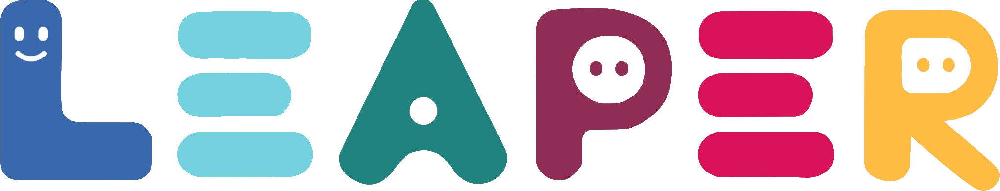

 

# Leaper: Digital Learning Platform

Leaper is a digital platform to manage learning system.

This is the frontend for the Leaper project, a basic LMS built around Nest.js and Flutter. This frontend is written in Flutter

> [!NOTE]
> This Project is Divided into two Repos. For the Back End Repo, see
> https://github.com/local-fish/Leaper-API

# Leaper - Flutter App

## Requirements

- [Flutter SDK](https://flutter.dev/docs/get-started/install) (with Dart)
- [Android SDK](https://developer.android.com/studio) (minSdk 23, compileSdk 36)
- A running instance of the [Leaper API](https://github.com/local-fish/Leaper-API)

## Setup

1. Clone the repository
2. Run `flutter pub get` to install dependencies
3. Create a `.env` file in the root of the project, or copy `.env.dev` if you're running on local machine, or `.env.prod` if you're running using the deployed version
